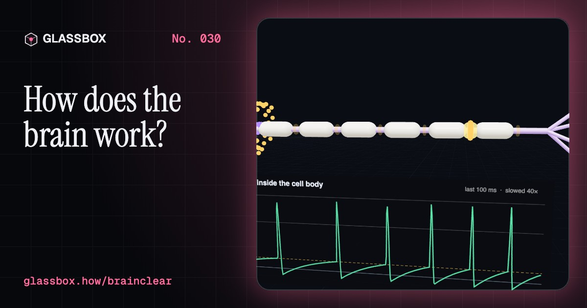
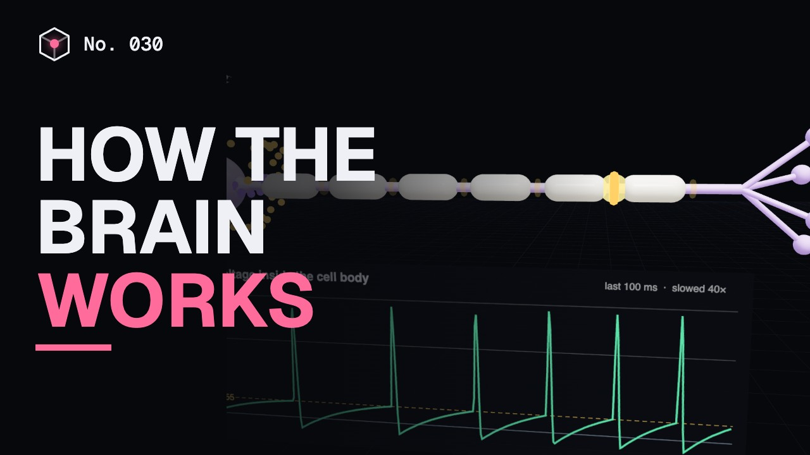
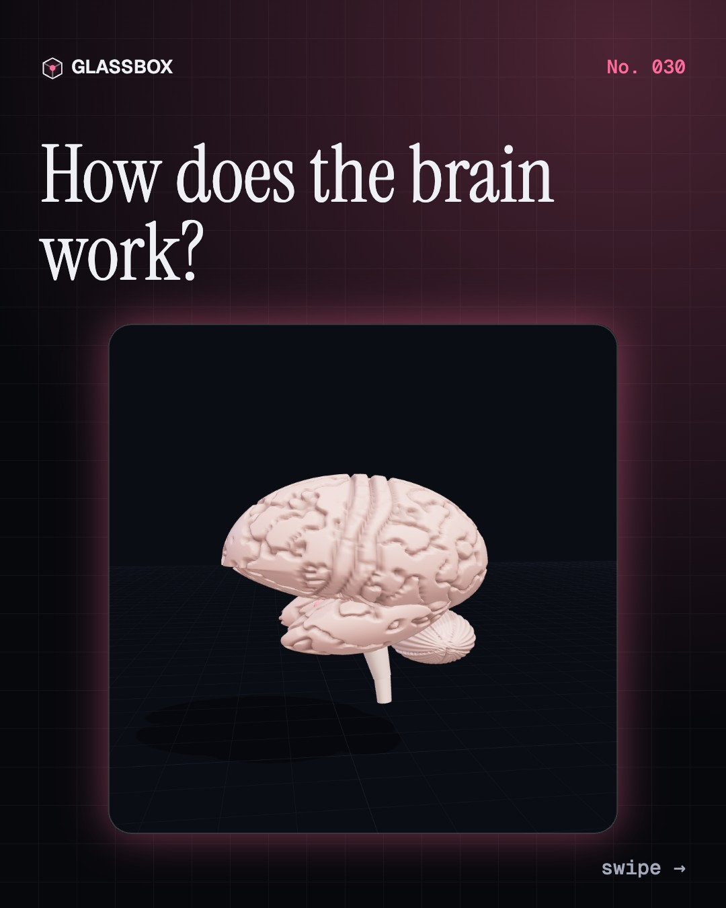
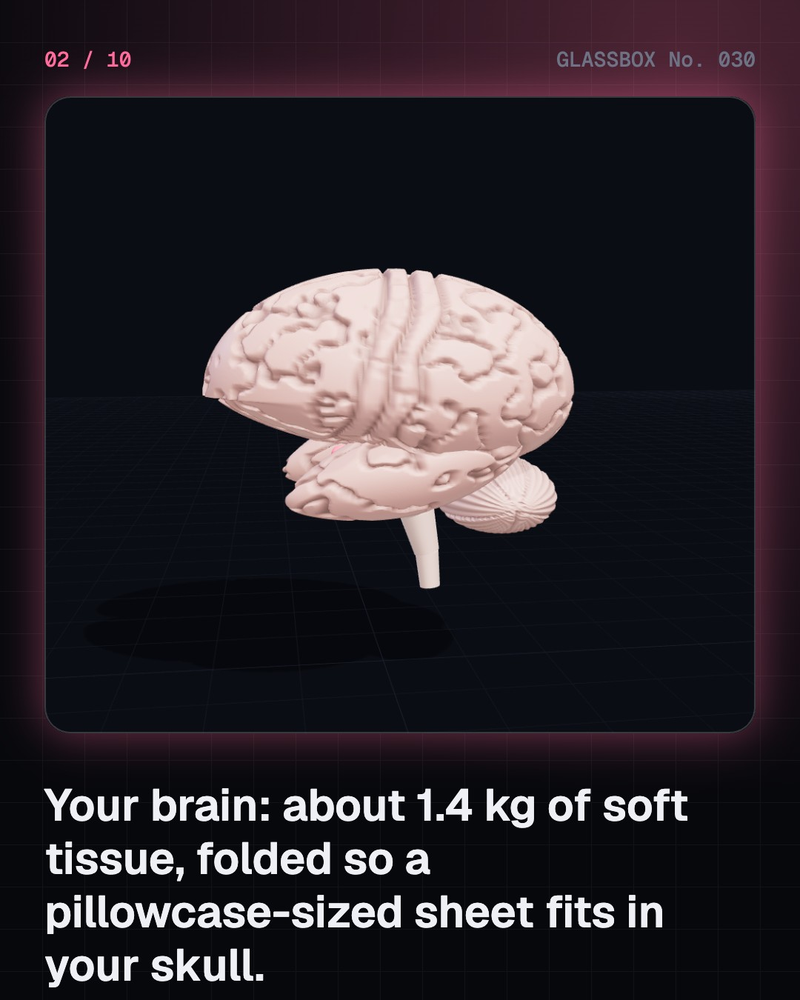
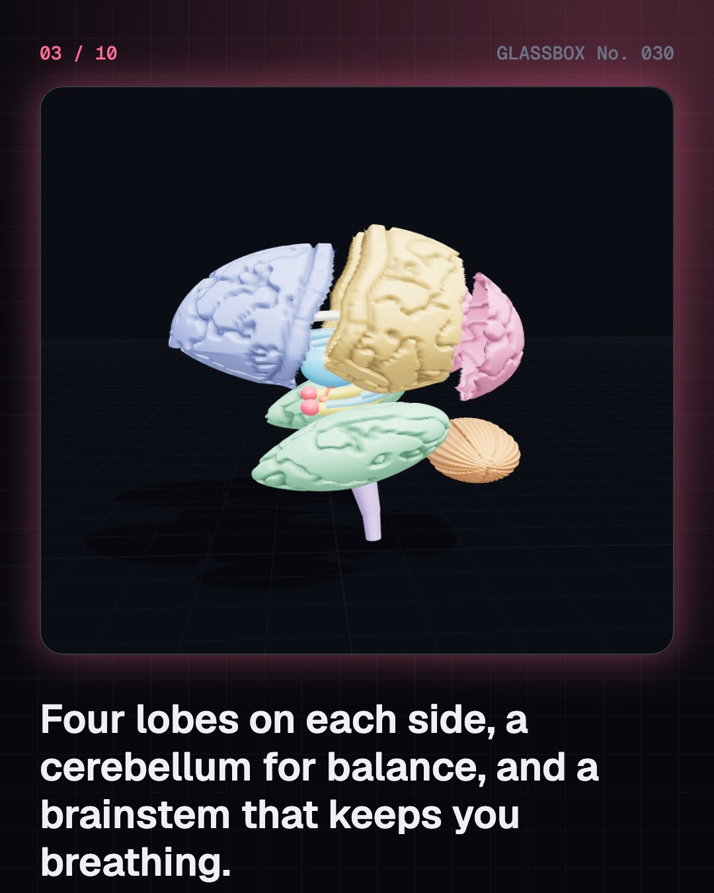
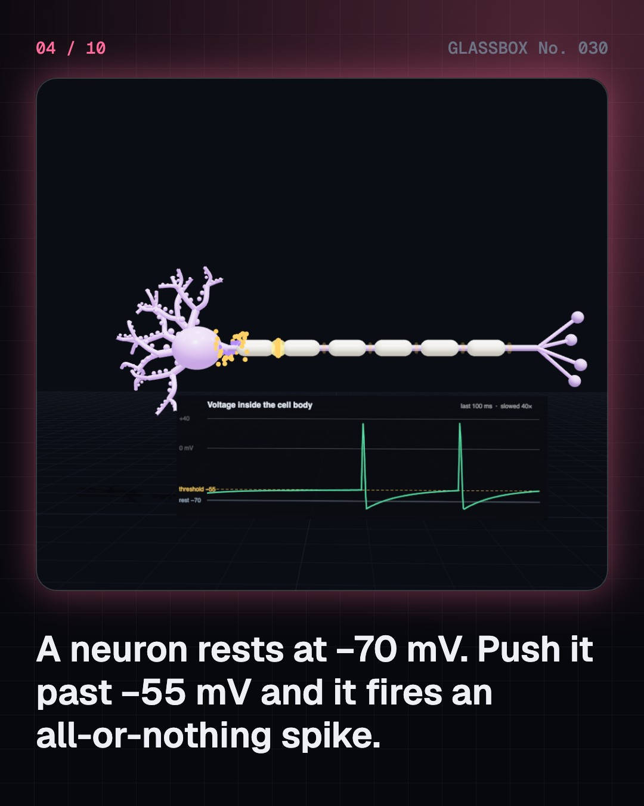

<!-- glassbox:start -->
<!-- Generated from glassbox.json by the Glassbox hub (npm run readme -- brainclear). Edit glassbox.json, not this block. -->
<p align="center"><a href="https://glassbox-production-fd52.up.railway.app/e/brainclear/"></a></p>

<h1 align="center">BrainClear</h1>

<p align="center"><b>How does the brain work?</b><br>86 billion neurons, 100 trillion connections and about 20 watts. Take a 3D brain apart, fire a neuron, light up the areas you use to speak, and watch memories move while you sleep.</p>

<p align="center"><a href="https://glassbox-production-fd52.up.railway.app/brainclear/"><b>▶ Play with it</b></a> &nbsp;·&nbsp; <a href="https://glassbox-production-fd52.up.railway.app/e/brainclear/">Read the 60-second explainer</a> &nbsp;·&nbsp; <a href="https://glassbox-production-fd52.up.railway.app/brainclear/glassbox/reel.mp4">Watch the 40-second video</a></p>

<p align="center">
  <a href="https://glassbox-production-fd52.up.railway.app/e/brainclear/"></a>
  <a href="https://glassbox-production-fd52.up.railway.app/e/brainclear/"></a>
  <a href="LICENSE"></a>
  <a href="LICENSE-CONTENT.md"></a>
  <a href="#privacy"></a>
</p>

## In 60 seconds

1. **Two halves, four lobes, one busy core.** The cerebrum's two hemispheres each have frontal, parietal, temporal and occipital lobes, wrapped in a folded cortex only 2 to 4 mm thick. Under the back sits the cerebellum, and the brainstem joins it all to the spinal cord. Deep inside are the thalamus, hippocampus, amygdala and basal ganglia.
2. **Neurons fire all-or-nothing spikes.** A neuron rests at about −70 mV. When its inputs push it past about −55 mV, sodium rushes in and it fires a 1 to 2 ms spike to about +35 mV. A stronger push makes more spikes, not bigger ones. Myelin makes spikes jump along the axon at up to about 120 m/s.
3. **Synapses turn sparks into chemicals.** At a synapse, the spike lets calcium in, vesicles spill neurotransmitter across a 20 nm gap, and receptors on the next cell open. Glutamate says go, GABA says stop. Many small inputs must add up to fire the next cell, and learning strengthens the synapses that are used together.
4. **Areas have jobs, but you use all of it.** Vision is at the back, hearing on the temporal lobe, movement and touch on strips either side of the central sulcus, with huge areas for hands and lips. Each side controls the opposite side of the body. The 10% myth and left-brain or right-brain personalities are myths: scans show the whole brain at work.
5. **Memories are sorted by day and filed by night.** The hippocampus tags new experiences, as the patient H.M. showed in 1953. Sleep runs in about 90-minute cycles, and during deep sleep the hippocampus replays the day to the cortex for long-term storage.
6. **A hungry organ that needs its blood.** At about 2% of body weight, the brain uses about 20% of the body's energy, about 20 W. A blocked artery, a stroke, can cost about 1.9 million neurons a minute, so learn BE FAST and call for help. For any worry about your own health, see a doctor.

## Words worth knowing

| Term | Meaning |
|---|---|
| **Neuron** | A nerve cell that receives signals on its dendrites and sends spikes along its axon. The brain has about 86 billion. |
| **Action potential** | A spike: a brief, all-or-nothing flip of a neuron's voltage from about −70 mV to about +35 mV. |
| **Myelin** | Fatty insulation around many axons that makes spikes jump between gaps, the nodes of Ranvier, much faster. |
| **Synapse** | The junction where one neuron passes a signal to another, usually by releasing a neurotransmitter. |
| **Neurotransmitter** | A chemical messenger such as glutamate (go), GABA (stop), dopamine or serotonin. |
| **Cortex** | The folded outer 2 to 4 mm of grey matter, where most thinking, sensing and planning happens. |
| **Hippocampus** | A curved structure deep in each temporal lobe that is key to forming new memories. |
| **Neuroplasticity** | The brain's ability to change its connections with learning, practice and recovery. |
| **Stroke** | Brain damage from a blocked or burst artery. Warning signs: BE FAST. |

## A short history

**8,500 years from holes in skulls to a count of 86 billion neurons.**

- **6500 BCE** · Stone Age surgeons open the skull (Neolithic people, France, and later across Europe, Asia and the Americas)
- **1600 BCE** · The first written description of the brain (Unknown Egyptian physician, Egypt)
- **400 BCE** · The brain is the seat of the mind (Hippocratic writers, Greece)
- **1664** · The word “neurology” is born (Thomas Willis, with drawings by Christopher Wren, Oxford, England)
- **1791** · Frog legs twitch with electricity (Luigi Galvani, Bologna, Italy)
- **1861** · Speech has a place (Paul Broca, Paris, France)
- **1906** · Rivals share a Nobel Prize (Camillo Golgi and Santiago Ramón y Cajal, Stockholm, Sweden)
- **1924** · The first human brain waves (Hans Berger, Jena, Germany)

The full story, with 31 moments, charts, people and 36 sources: [glassbox.how/e/brainclear/history](https://glassbox-production-fd52.up.railway.app/e/brainclear/history/). The data lives in [`history.json`](history.json).

## Video and slides

Made with the Glassbox studio from this box's storyboard (`window.glassbox.director`). Free to reuse under CC BY 4.0.

<a href="https://glassbox-production-fd52.up.railway.app/brainclear/glassbox/video.mp4"></a>

<p><a href="glassbox/slide-1.jpg"></a> <a href="glassbox/slide-2.jpg"></a> <a href="glassbox/slide-3.jpg"></a> <a href="glassbox/slide-4.jpg"></a></p>

| File | What | Size |
|---|---|---|
| [`glassbox/reel.mp4`](https://glassbox-production-fd52.up.railway.app/brainclear/glassbox/reel.mp4) | Reel / Short, with captions and soundtrack | 1080×1920 |
| [`glassbox/video.mp4`](https://glassbox-production-fd52.up.railway.app/brainclear/glassbox/video.mp4) | YouTube video, with captions and soundtrack | 1920×1080 |
| `glassbox/slide-1…10.jpg` | Instagram carousel | 1080×1350 |
| `glassbox/thumb.jpg` | YouTube thumbnail | 1280×720 |
| `glassbox/cover.jpg` | Share card and repo social preview | 1200×630 |
| [`glassbox/history-reel.mp4`](https://glassbox-production-fd52.up.railway.app/brainclear/glassbox/history-reel.mp4) | “History in 10 moments” Reel / Short | 1080×1920 |
| `glassbox/history-slide-*.jpg` | History carousel | 1080×1350 |
| `glassbox/post.json` | Post copy and schedule used by the publish kit | |

## Privacy

This box has no accounts and no ads, and it ships its own fonts and libraries. When you run it yourself it sends nothing anywhere. On glassbox.how, the site's `/bar.js` also loads Glassbox's analytics: **Google Analytics** to count visits (it asks first in the EU, UK and Switzerland, and stays off when your browser sends Global Privacy Control or Do Not Track) and **ClickTrust** to detect bots.

It remembers a few things **in your own browser only**, and never sends them anywhere:

| Browser storage key | What it holds |
|---|---|
| `brainclear.v1` | Which chapters you have opened, your best quiz scores, and sound on or off. |

Exactly what each one sees is at [glassbox.how/privacy](https://glassbox-production-fd52.up.railway.app/privacy/).

## Licences

- **Code:** [MIT](LICENSE). Use it, change it, ship it.
- **Explanations, text, images and videos** (`glassbox.json`, `glassbox/`): [CC BY 4.0](LICENSE-CONTENT.md). Credit “Glassbox, glassbox.how/e/brainclear”.
- **Third-party parts** keep their own licences: [three.js](https://threejs.org) (MIT), [Geist, Instrument Serif](https://openfontlicense.org) (SIL OFL 1.1).
- The Glassbox name and logo aren't covered by either licence. See the [terms](https://glassbox-production-fd52.up.railway.app/terms/).

Found a mistake? [Open an issue](https://github.com/bdeeps/brainclear/issues). Corrections happen in public.
<!-- glassbox:end -->

## Run it

It's plain HTML, CSS and JavaScript. No build step and no dependencies. Run locally, it contacts no other website.

```bash
python3 -m http.server 8000
```

Three.js and the fonts ship in `vendor/` and `fonts/`, so it also works offline.

Then open http://localhost:8000.

## How it's built

| File | What |
|---|---|
| `index.html`, `css/app.css` | The page and its styles |
| `js/app.js`, `js/stage.js`, `js/ui.js`, `js/kit.js` | The shared Glassbox 3D engine: chapters, 3D stage, controls, quiz, video director |
| `js/chapters/*.js` | One file per chapter: the 3D model, controls, text, key terms, quiz and video scenes |
| `js/brain.js` | The shared 3D brain (lobes, gyri and sulci, cerebellum, brainstem, deep structures), what each part does, functional areas, and sourced numbers |
| `js/neuron.js` | The 3D neuron and synapse, and the spike model (resting −70 mV, threshold −55 mV, integrate-and-fire) |
| `glassbox.json` | Title, question, explainer beats, key terms, browser storage and credits shown on glassbox.how |
| `reel` in each chapter | The storyboard the Glassbox studio records into short videos |
| `glassbox/` | The published video, slides, thumbnail and post copy |
| `fonts/`, `vendor/three/` | Self-hosted Geist and Instrument Serif (SIL OFL 1.1) and three.js (MIT) |
